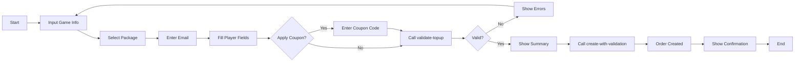

# API ตรวจสอบการเติมเกม (Top-Up Validation API)

**ภาษา**: Thai/English

---

## 📋 ภาพรวม (Overview)

API นี้ใช้สำหรับตรวจสอบข้อมูลสำคัญทั้งหมดก่อนสร้างคำสั่งซื้อการเติมเกม โดยตรวจสอบ:

1. **Game ID** - ตรวจสอบว่าเกมมีอยู่และเปิดใช้งาน
2. **Package ID** - ตรวจสอบว่าแพ็กเกจมีอยู่และเปิดใช้งาน
3. **Email** - ตรวจสอบรูปแบบอีเมล
4. **Player Fields** - ตรวจสอบว่าข้อมูลผู้เล่นครบถ้วนตามที่เกมต้องการ
5. **Coupon Code** (ถ้ามี) - ตรวจสอบว่าคูปองมีผลและสามารถใช้ได้

---

## 🔑 Endpoints

### 1. ตรวจสอบการเติมเกม (Quick Validation)

**Endpoint:**
```
POST /orders/validate-topup?userId={id}
```

**คำอธิบาย**: ตรวจสอบข้อมูลทั้งหมดแต่ไม่สร้างคำสั่งซื้อ

**Request Body:**
```json
{
  "gameId": 1,
  "packageId": 2,
  "email": "player@example.com",
  "playerFields": [
    {
      "key": "player_id",
      "value": "12345678"
    },
    {
      "key": "server_id",
      "value": "S1"
    }
  ],
  "couponCode": "NEWPLAYER20"
}
```

**Response (สำเร็จ):**
```json
{
  "success": true,
  "message": "ตรวจสอบการเติมเกมสำเร็จ",
  "data": {
    "gameId": 1,
    "gameName": "Mobile Legends",
    "packageId": 2,
    "packageName": "Elite Pass - 1 Month",
    "packagePrice": 399.00,
    "email": "player@example.com",
    "playerFieldsValid": true,
    "couponApplied": {
      "code": "NEWPLAYER20",
      "discountType": "PERCENTAGE",
      "discountValue": 20,
      "discountAmount": 79.80
    },
    "estimatedPrice": 319.20
  },
  "errors": [],
  "warnings": []
}
```

**Response (ล้มเหลว):**
```json
{
  "success": false,
  "message": "ตรวจสอบการเติมเกมล้มเหลว",
  "data": null,
  "errors": [
    {
      "field": "gameId",
      "message": "Game not found or inactive | ไม่พบเกมหรือเกมไม่เปิดใช้งาน"
    },
    {
      "field": "playerFields",
      "message": "Missing required field: player_id | ขาดข้อมูลที่จำเป็น: player_id"
    }
  ],
  "warnings": []
}
```

---

### 2. สร้างคำสั่งซื้อพร้อมตรวจสอบ (Create Order with Validation)

**Endpoint:**
```
POST /orders/create-with-validation?userId={id}
```

**คำอธิบาย**: ตรวจสอบข้อมูลและสร้างคำสั่งซื้อหากทั้งหมดถูกต้อง

---

### 3. เตรียมข้อมูลคำสั่งซื้อสำหรับหน้าชำระเงิน (Order Preparation for Payment)

**Endpoint:**
```
GET /orders/prepare-payment?orderId={id}&userId={id}
```

**คำอธิบาย**: เตรียมข้อมูลทั้งหมดที่จำเป็นสำหรับหน้าชำระเงิน (Order ID, รายละเอียดรายการ, ข้อมูลผู้เล่น, อีเมล, คูปอง, ยอดเงิน)

**Request Body:**
```json
{
  "gameId": 1,
  "packageId": 2,
  "email": "player@example.com",
  "playerFields": [
    {
      "key": "player_id",
      "value": "12345678"
    }
  ],
  "couponCode": "NEWPLAYER20"
}
```

**Response (สำเร็จ):**
```json
{
  "success": true,
  "message": "สร้างคำสั่งซื้อสำเร็จ",
  "data": {
    "orderId": 123,
    "gameId": 1,
    "gameName": "Mobile Legends",
    "packageId": 2,
    "packageName": "Elite Pass - 1 Month",
    "originalPrice": 399.00,
    "discountAmount": 79.80,
    "finalPrice": 319.20,
    "couponCode": "NEWPLAYER20",
    "playerEmail": "player@example.com",
    "status": "PENDING",
    "createdAt": "2026-04-16T10:30:00Z"
  },
  "errors": [],
  "warnings": []
}
```

---

**Request:**
```bash
GET /orders/prepare-payment?orderId=123&userId=1
```

**Response (สำเร็จ):**
```json
{
  "success": true,
  "message": "เตรียมข้อมูลคำสั่งซื้อสำหรับชำระเงินสำเร็จ",
  "data": {
    "orderId": 123,
    "orderDetails": {
      "gameName": "Mobile Legends",
      "packageName": "Elite Pass - 1 Month",
      "packageDescription": "Perfect for competitive players - 1 month pass"
    },
    "packageId": 2,
    "playerInformation": {
      "userId": 1,
      "email": "player@example.com",
      "gameUid": "12345678"
    },
    "email": "player@example.com",
    "couponCode": "NEWPLAYER20",
    "amounts": {
      "originalPrice": 399.00,
      "discountAmount": 79.80,
      "finalPrice": 319.20
    },
    "createdAt": "2026-04-16T10:30:00Z",
    "status": "PENDING"
  },
  "errors": []
}
```

**Response (ล้มเหลว - Order not found):**
```json
{
  "success": false,
  "message": "ไม่พบคำสั่งซื้อ",
  "errors": ["Order ID not found in database"]
}
```

---

## 📊 Validation Checks (รายละเอียดการตรวจสอบ)

| ลำดับ | ตรวจสอบ | เงื่อนไข | ข้อความ Error (ไทย) |
|------|---------|---------|-------------------|
| 1 | Game | ต้องมีอยู่และเปิดใช้งาน | "Game not found or inactive \| ไม่พบเกมหรือเกมไม่เปิดใช้งาน" |
| 2 | Package | ต้องมีอยู่และเปิดใช้งาน | "Package not found or inactive \| ไม่พบแพ็กเกจหรือแพ็กเกจไม่เปิดใช้งาน" |
| 3 | Email | ต้องเป็นอีเมลที่ถูกต้อง | "Invalid email format \| รูปแบบอีเมลไม่ถูกต้อง" |
| 4 | Player Fields | ต้องครบถ้วนตามที่เกมต้องการ | "Missing required field: {fieldName} \| ขาดข้อมูลที่จำเป็น: {fieldName}" |
| 5 | Coupon | ต้องมีอยู่และมีผล (ถ้ามี) | "Coupon not found or expired \| ไม่พบคูปองหรือคูปองหมดอายุ" |

---

## 🔐 Authentication

ต้องส่ง `userId` เป็น query parameter:

```bash
curl -X POST "http://localhost:3000/orders/validate-topup?userId=1" \
  -H "Content-Type: application/json" \
  -d '{...}'
```

---

## 💰 Discount Calculation (การคำนวณส่วนลด)

### FIXED (ส่วนลดคงที่)
```
Discount Amount = discountValue
Final Price = Package Price - Discount Amount
```
ตัวอย่าง: 100 THB ส่วนลด
- Package Price: 500 THB
- Final Price: 500 - 100 = 400 THB

### PERCENTAGE (ส่วนลดเป็นเปอร์เซนต์)
```
Discount Amount = Package Price × (discountValue / 100)
Final Price = Package Price - Discount Amount
```
ตัวอย่าง: 20% ส่วนลด
- Package Price: 500 THB
- Discount Amount: 500 × 0.20 = 100 THB
- Final Price: 500 - 100 = 400 THB

---

## 📝 Request/Response Formats

### ValidateTopupDto (Request)

```typescript
{
  gameId: number;           // ID ของเกม (บังคับ)
  packageId: number;        // ID ของแพ็กเกจ (บังคับ)
  email: string;            // อีเมลผู้เล่น (บังคับ)
  playerFields: Array<{     // ข้อมูลผู้เล่น (บังคับ)
    key: string;            // ชื่อฟิลด์
    value: string;          // ค่าฟิลด์
  }>;
  couponCode?: string;      // รหัสคูปอง (ไม่บังคับ)
}
```

### ValidateTopupResponseDto (Response)

```typescript
{
  success: boolean;         // ผลการตรวจสอบ
  message: string;          // ข้อความ (ภาษาไทย)
  data: {                   // ข้อมูลการตรวจสอบ
    gameId: number;
    gameName: string;
    packageId: number;
    packageName: string;
    packagePrice: number;
    email: string;
    playerFieldsValid: boolean;
    couponApplied?: {
      code: string;
      discountType: 'FIXED' | 'PERCENTAGE';
      discountValue: number;
      discountAmount: number;
    };
    estimatedPrice: number;
  } | null;
  errors: Array<{           // รายการ errors
    field: string;
    message: string;        // ข้อความ (ไทย + อังกฤษ)
  }>;
  warnings: Array<{         // รายการ warnings
    field: string;
    message: string;
  }>;
}
```

---

## 🔗 Integration with Frontend (การใช้งานกับ Frontend)

### ตัวอย่างการใช้ API Client

```typescript
import axios from 'axios';

const validateTopup = async (
  userId: number,
  gameId: number,
  packageId: number,
  email: string,
  playerFields: Array<{ key: string; value: string }>,
  couponCode?: string
) => {
  try {
    const response = await axios.post(
      `/api/orders/validate-topup?userId=${userId}`,
      {
        gameId,
        packageId,
        email,
        playerFields,
        couponCode,
      }
    );
    return response.data;
  } catch (error) {
    return error.response?.data;
  }
};
```

### React Component Example

```tsx
import { useState } from 'react';
import { CouponValidator } from '@/components/CouponValidator';

export function TopupCheckout({ userId, gameId }: Props) {
  const [formData, setFormData] = useState({
    packageId: 0,
    email: '',
    playerFields: [],
    couponCode: '',
  });
  const [validation, setValidation] = useState(null);

  const handleValidate = async () => {
    const result = await validateTopup(
      userId,
      gameId,
      formData.packageId,
      formData.email,
      formData.playerFields,
      formData.couponCode
    );
    setValidation(result);
  };

  if (!validation?.success) {
    return <div>ข้อมูลไม่ถูกต้อง: {validation?.errors[0]?.message}</div>;
  }

  return (
    <div>
      <h2>ยืนยันการเติมเกม</h2>
      <p>ราคารวม: {validation.data.estimatedPrice} THB</p>
      <button onClick={() => completeCheckout()}>ชำระเงิน</button>
    </div>
  );
}
```

---

## ⚠️ Error Handling

### Common Errors (ข้อผิดพลาดที่พบบ่อย)

| HTTP Status | Error Code | ข้อความ (ไทย) | วิธีแก้ |
|---|---|---|---|
| 400 | INVALID_GAME | ไม่พบเกม | ตรวจสอบ gameId |
| 400 | INVALID_PACKAGE | ไม่พบแพ็กเกจ | ตรวจสอบ packageId |
| 400 | INVALID_EMAIL | อีเมลไม่ถูกต้อง | ใช้อีเมลที่ถูกต้อง |
| 400 | INCOMPLETE_PLAYER_FIELDS | ข้อมูลผู้เล่นไม่ครบ | กรอกข้อมูลผู้เล่นทั้งหมด |
| 400 | INVALID_COUPON | คูปองไม่ถูกต้อง | ตรวจสอบรหัสคูปอง |
| 404 | USER_NOT_FOUND | ไม่พบผู้ใช้ | ตรวจสอบ userId |
| 500 | INTERNAL_ERROR | เกิดข้อผิดพลาด | ลองใหม่อีกครั้ง |

---

## 📋 Example Workflow (ขั้นตอนการใช้งาน)



---

## 🧪 Testing with cURL (การทดสอบด้วย cURL)

### ทดสอบการตรวจสอบแบบง่าย

```bash
curl -X POST "http://localhost:3000/orders/validate-topup?userId=1" \
  -H "Content-Type: application/json" \
  -d '{
    "gameId": 1,
    "packageId": 1,
    "email": "test@example.com",
    "playerFields": [
      {"key": "player_id", "value": "12345"}
    ],
    "couponCode": "NEWPLAYER20"
  }'
```

### ทดสอบการสร้างคำสั่งซื้อ

```bash
curl -X POST "http://localhost:3000/orders/create-with-validation?userId=1" \
  -H "Content-Type: application/json" \
  -d '{
    "gameId": 1,
    "packageId": 1,
    "email": "test@example.com",
    "playerFields": [
      {"key": "player_id", "value": "12345"}
    ],
    "couponCode": "NEWPLAYER20"
  }'
```

### ทดสอบเตรียมข้อมูลสำหรับหน้าชำระเงิน

```bash
curl -X GET "http://localhost:3000/orders/prepare-payment?orderId=123&userId=1" \
  -H "Content-Type: application/json"
```

---

## 📞 Support

สำหรับข้อมูลเพิ่มเติม โปรดดู:
- [COUPON_API.md](./COUPON_API.md) - API ตรวจสอบคูปอง
- [SETUP_GUIDE.md](./SETUP_GUIDE.md) - คู่มือการตั้งค่า
